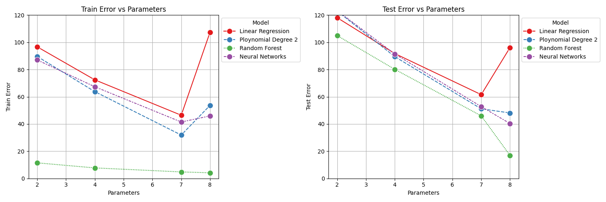
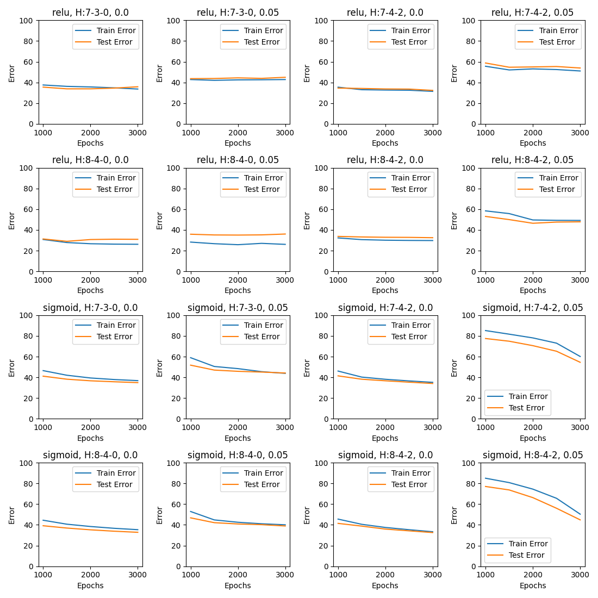
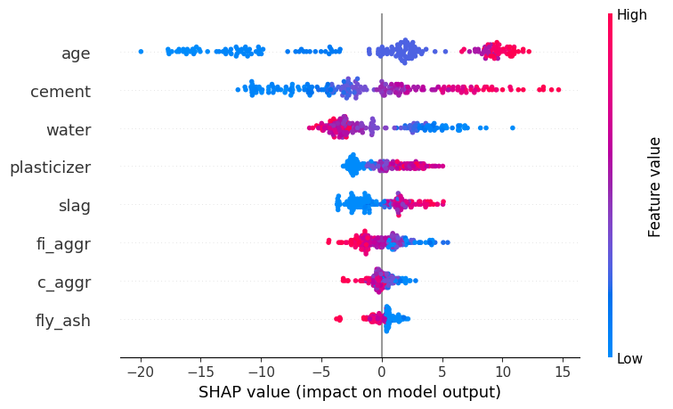

# 🏗️ Predicting concrete compressive strength with multiple ML models and SHAP-based explainability

This repository contains a reproducible study that implements and compares four machine-learning approaches to predict the compressive strength of concrete. Models are evaluated with standard regression metrics and interpretation is provided using **SHAP (SHapley Additive exPlanations)** to open the model “black box” and identify the most influential features.


---

## 📌 Project Overview
Concrete compressive strength is a critical indicator of structural performance and durability in civil engineering. Accurately predicting it helps engineers optimize material proportions, reduce costs, and ensure safety. Traditional empirical approaches often fail to capture the complex, nonlinear relationships among concrete ingredients — motivating the use of **machine learning (ML)**.

In this project, four different ML algorithms were implemented and evaluated:

- **Linear Regression** – a baseline statistical model for linear relationships.
- **Polynomial Regression** – extends Linear Regression by modeling nonlinear interactions.
- **Random Forest** – an ensemble learning method leveraging multiple decision trees for robust, high-accuracy predictions.
- **Neural Networks** – capable of capturing complex, nonlinear patterns in the data.

Performance comparison was conducted using **Mean Squared Error (MSE)**, **Mean Absolute Error (MAE)**, and **R²** metrics.
Additionally, **SHAP (SHapley Additive exPlanations)** was applied to interpret model predictions and identify the most influential features contributing to concrete strength, thus addressing the “black-box” challenge of complex ML models.

**Summary of Results**
- Random Forest achieved the best overall performance with an **R² score of 0.927**.
- Neural Networks also performed well, with an **R² score of 0.861**.
- SHAP analysis revealed that **age, cement, slag**, and **superplasticizer** have positive contributions, while **water, fine aggregate, fly ash**, and **coarse aggregate** negatively impact the predicted compressive strength.


---

## 📈 Workflow Summary

`1_clean-visual.py` — **Data Cleaning & Visualization**
  - Loads the **Concrete Compressive Strength** dataset from the UCI Machine Learning Repository.
  - Handles missing values and performs basic preprocessing.
  - Conducts **exploratory data analysis (EDA)** through descriptive statistics and visualizations (histograms, pair plots, and correlation heatmaps) to understand feature relationships.

`2_feature-selection.py` — **Feature Engineering & Selection**
  - Analyzes correlations among features and target variable.
  - **Compares different feature combinations** and evaluates their corresponding model errors to identify the most predictive inputs. 
  - Prepares the final **feature matrix (X)** and **target vector (y)** for modeling.

`3_best-params.py` — **Model Training & Hyperparameter Optimization**
  - Performs systematic **hyperparameter tuning** to identify the optimal configurations for each model.
  - For **Random Forest**, employs **Grid Search** or **Randomized Search** to optimize parameters such as the number of estimators, maximum tree depth, and minimum samples per split.
  - For **Neural Networks**, experiments with different **network architectures** — varying the number of hidden layers, neurons per layer, **activation functions, dropout rates**, and **training epochs** — to achieve the best balance between bias and variance.
  - Compares the performance of all models using regression metrics (MSE) to select the most effective predictor for concrete compressive strength.

`4_XAI-SHAP.py` — ***Explainable AI (SHAP Analysis)**
  - Applies **SHAP (SHapley Additive exPlanations)** to interpret feature importance.
  - Generates summary plots and dependence plots to visualize each feature’s contribution to predictions.
  - Highlights the most influential variables affecting concrete compressive strength, overcoming the “black-box” nature of complex models.


---

## 🧠 Dataset and License

This project uses the Concrete Compressive Strength dataset, obtained directly from the UCI Machine Learning Repository using the following Python command:

```bash
from ucimlrepo import fetch_ucirepo
concrete_data = fetch_ucirepo(id=165)
```
Dataset Reference:

```bash
I. Yeh, "Concrete Compressive Strength," UCI Machine Learning Repository, 1998.
https://doi.org/10.24432/C5PK67
```

The dataset is provided under the ***Creative Commons Attribution 4.0 International (CC BY 4.0) license***. This license allows for sharing and adaptation of the dataset for any purpose, provided that appropriate credit is given to the original author and source.

In this repository, the dataset is **not redistributed**; instead, it is **downloaded automatically from the official source** to ensure proper attribution and compliance with the license terms.


---
## ⚙️ Requirements and Dependencies

This project was developed in **Python 3.10+** and relies on several open-source libraries for data handling, visualization, modeling, and explainability.

### 📦 Core Packages

| Category | Libraries |
| --- | --- |
| **Data Handling & Utilities** | `pandas`, `numpy`, `pathlib`, `os`, `csv`, `random` |
| **Visualization** | `matplotlib`, `seaborn` |
| **Data Source** | `ucimlrepo` _(for direct download of the UCI dataset)_ |
| **Machine Learning** | `scikit-learn` (`linear_model`, `ensemble`, `metrics`, `preprocessing`, `model_selection`) |
| **Deep Learning** | `tensorflow`, `keras`, `scikeras` |
| **Explainable AI** | `shap` |

### 🧩 Installation

You can install all required dependencies using the following command:

```bash 
pip install -r requirements.txt
```

or manually:
```bash
pip install pandas numpy seaborn matplotlib ucimlrepo scikit-learn tensorflow scikeras shap
```

You can find the complete list of required libraries in the `requirements.txt` file.

---


## ▶️ How to Run
 
The workflow is modular and organized into four main scripts. Execute them in order:

**Data Cleaning & Visualization**
```bash
python 1_clean-visual.py
```


**Feature Engineering & Selection**
```bash
python 2_feature-selection.py
```

**Model Training & Hyperparameter Optimization**

```bash
python 3_best-params.py
```

**Explainable AI with SHAP Analysis**
```bash
python 4_XAI-SHAP.py
```

Each script is self-contained and automatically saves its outputs:
  - **Plots** → Results/ folder
  - **Cleaned and processed data** → Data/ folder
  - **Text-based results and metrics** → project root (main) folder

This structure ensures all outputs are organized and easy to access for analysis or further experimentation.

---

## 📊 Some Results

A plot was generated to evaluate the error values for both the training and testing sets across all four models, using different combinations of input features. The visualization shows that including all available features as inputs produces the most accurate predictions, highlighting the importance of comprehensive feature selection for optimal model performance. Although the training errors are slightly higher for 8-feature-input, this is due to filtering the age to 28 days for the other feature combinations, which limits the training data and affects model fitting.



Another part of the research focused on identifying the **optimal neural network architecture**. Various configurations were tested, including different **numbers of layers, neurons per layer, training epochs, activation functions,** and **dropout rates**, to determine the most effective structure. The results of this hyperparameter tuning are illustrated in the figure below. In this study, the tuning process was performed manually; however, it is worth noting that automated approaches such as **Bayesian Optimization** in the field of **Automated Machine Learning (AutoML)**, and **Neural Architecture Search (NAS)** — can also be employed to efficiently explore and optimize neural network configurations.





In the SHAP analysis, shown below figure, The position of a point along the X-axis shows how much that feature’s value contributed to increasing or decreasing the prediction. Points that are located to the right of the vertical zero line indicate a positive contribution and the points located to the left indicate a negative contribution.
For cement, red points (high values) on the positive side indicate a positive impact on compressive strength, while blue points (low values) on the negative side show a reduction, suggesting a strong positive correlation.
For water, the pattern is opposite: red points (high values) on the negative side indicate a reduction in compressive strength, and blue points (low values) on the positive side indicate an improvement, showing an inverse relationship.





